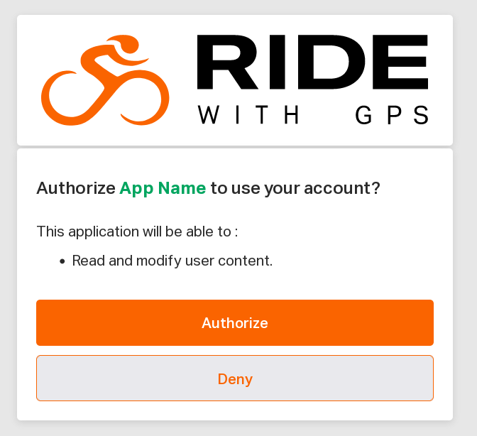

# Authentication with OAuth

Ride with GPS is an OAuth provider.

## Configuration

Your application is configured for OAuth with Ride with GPS with the following:

* `name`: the name of your application
* `redirect_uri`: one or more callback URI where users are redirected during the authorization flow

Ride with GPS provides you with:

* `client_id`: your OAuth client ID
* `client_secret`: your OAuth client secret

## Authorization flow

### 1. Authorize

Your application sends the user to the authorization web page on the Ride with GPS website:

```
GET https://ridewithgps.com/oauth/authorize
  ?client_id=<client_id>
  &redirect_uri=<redirect_uri>
  &response_type=code
```

`redirect_uri` must match one of the URIs configured for your application.

The user will be presented with the following interface:



Once the user clicks the `Authorize` button, they are redirected to `redirect_uri` with an access grant:

```
<redirect_uri>?code=<access_grant>
```

### 2. Fetch access_token

Using the access grant, your application fetches the `access_token`:

`POST https://ridewithgps.com/oauth/token.json`

with the following request body:

```javascript
{
  "grant_type": "authorization_code",
  "code": "<access_grant>",
  "client_id": "<client_id>",
  "client_secret": "<client_secret>",
  "redirect_uri": "<redirect_uri>"
}
```

Note that `redirect_uri` in the payload must match the one used in the first step above.

The response includes the OAuth2 `access_token` to use for further authentication:

```javascript
{
  "access_token": "<access_token>",
  "token_type": "Bearer",
  "scope": "user",
  "created_at": epoch_timestamp
  "user_id": user_id
}
```

`user_id` is a the Ride with GPS id for the user who completed the autorization flow.

### 3. Make OAuth authenticated requests

Your application can then make requests on the Ride with GPS API with the `Authorization` header to authenticate as your user:

```
GET https://ridewithgps.com/users/current.json
Authorization: Bearer <access_token>
```

## Convert legacy auth_token to OAauth2 access_token

The `GET /oauth_access_token.json` endpoint issues OAuth `access_token`s for the `auth_token`s your application might have stored for your users. Use this endpoint to migrate to OAuth without requiring your users to authorize your application with Ride with GPS again.

The endpoint requires authenticating with the `auth_token` for which a OAuth `access_token` is to be issued, which is done by adding the following headers to the request:

```
GET /oauth_access_token.json
x-rwgps-auth-token: <auth_token>
x-rwgps-api-key: <api_key>
```

If your `api_key` has been configured to support OAuth, the response contains the `access_token`:

```javascript
{
  "access_token": "<access_token>",
  "token_type": "Bearer",
  "scope": "user",
  "created_at": epoch_timestamp
  "rwgps_user_id": user_id
}
```

* The request is idempotent, it will respond with the same `access_token` when repeated.
* `auth_token` remains valid for authentication after a corresponding OAuth `access_token` has been issued.

To authenticate requests with the OAuth `access_token`, add it as a header of your requests:

```
Authorization: Bearer <access_token>
```
